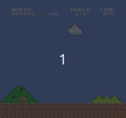
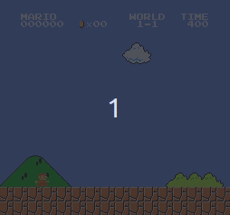
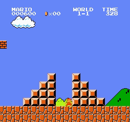

# NEAT-Mario
Solving the game of super mario bros. with NEAT(Neural Evolution through Augmenting Topologies)

[NeuroEvolution through Augmenting Topologies (NEAT)](http://nn.cs.utexas.edu/downloads/papers/stanley.ec02.pdf) is a genetic algorithm (GA) for the generation of evolving artificial neural networks (a neuroevolution technique).

Generation 1:-    

Generation 30:-  

Generation 600:-  

